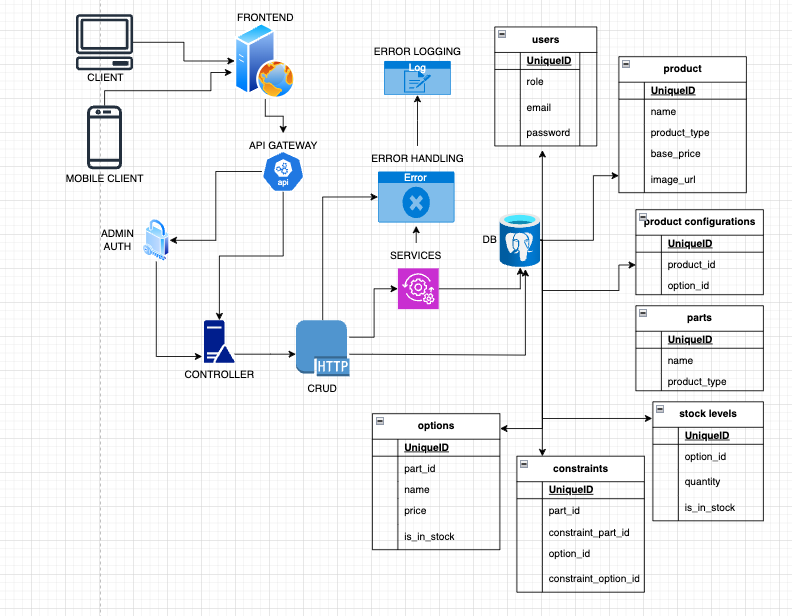

# Overview

The e-commerce application is a two-part system consisting of a backend Rails API and a [frontend React application](https://github.com/ilcande/ecommerce-shop-frontend). The backend Rails application serves as an API-only server that provides a robust and scalable interface for CRUD operations, business logic, and data management. The frontend React application, styled with Tailwind CSS, acts as the user interface through which end-users interact with the application.

## Architecture Backend (Rails API)

Technology Stack:

  1. **Ruby on Rails**: Framework for building the API, following RESTful principles.
  2. **PostgreSQL**: Database management system for data persistence.

### Components

  Controllers:

  Handle HTTP requests and responses.
  Route requests to appropriate services or perform direct CRUD operations.
  Examples: `Admin::ProductsController` for managing product creation and updates.

  Services:

  Encapsulate business logic and complex operations.
  Used to keep controllers thin and focused on handling HTTP requests.
  Examples: `ProductConfiguratorService` for managing product configuration and options.

  Models:

  Define the data structure and relationships.
  Validate and interact with the PostgreSQL database.
  Examples: `Product`, `Option`, `StockLevel`.

  Error Handling and Logging:

  Centralized error handling and logging are implemented to capture and manage errors and log information for debugging and monitoring.
  Use of Rails' built-in logging mechanisms and potentially external services like Sentry for error tracking.

  Authentication and Authorization:

  `Admin` users are authenticated using `Devise`, with access controlled by role-based authorization.
  Generic users interact with the public-facing parts of the application, such as product browsing and cart management.

## Data Flow

The frontend React application interacts with the backend Rails API through HTTP requests. The API processes these requests, performs CRUD operations on the PostgreSQL database, and returns the appropriate responses. The frontend application then updates the UI based on the responses received.
  **User Interaction**:
  Users interact with the frontend React application via UI components.

  **API Requests**:
  React components make HTTP requests to the Rails API using Axios.

  **Controller Handling**:
    Rails controllers receive requests, perform necessary operations, and send responses.

  **Service Layer (if applicable)**:
    Complex business logic is handled by service objects.

  **Database Operations**:
    Models interact with PostgreSQL to perform CRUD operations.

  **Response Handling**:
    The Rails API returns data or status codes, which are then processed by React components.
  
  **Error Logging and Authentication**:
    Errors are logged and managed centrally.
    Authentication ensures secure access to administrative functions.

## System Design

The system is designed to be modular, scalable, and maintainable. The separation of concerns between the frontend and backend allows for independent development and deployment of each part. The backend API follows RESTful principles, providing a clear and consistent interface for data management.

## Scalability and Performance

The system is designed to be scalable and performant by following best practices and utilizing appropriate technologies.

  **Scalability**:
    Both the backend and frontend are designed to handle growing user bases and data sizes.

  **Database Optimization**:
    Proper indexing, query optimization, and database tuning to improve performance.

  **Maintainability**:
    The separation of concerns (controllers, services, models) ensures that the codebase is maintainable and extensible.
